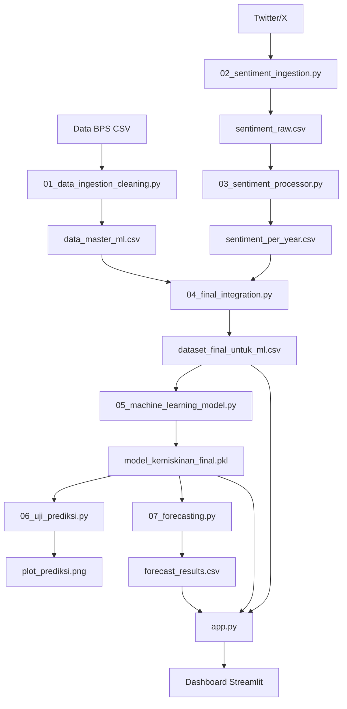

# 📊 Big Data: Analisis TPT vs P0 (Kemiskinan)

Proyek analisis Big Data untuk memprediksi tingkat kemiskinan (P0) di Indonesia berdasarkan Tingkat Pengangguran Terbuka (TPT), Garis Kemiskinan (GK), dan sentimen publik dari media sosial menggunakan Machine Learning.

## 🎯 Deskripsi Project

Project ini mengintegrasikan data ekonomi dari BPS (Badan Pusat Statistik) dengan analisis sentimen media sosial untuk:
- Menganalisis hubungan antara TPT dan tingkat kemiskinan (P0, P1, P2)
- Memprediksi tingkat kemiskinan menggunakan model Machine Learning
- Memvisualisasikan tren kemiskinan dan pengangguran melalui dashboard interaktif
- Melakukan forecasting kemiskinan untuk tahun 2026-2027

## 🏗️ Struktur Project

```
BigDataProject/
├── Data_Source/                          # Data mentah dari BPS
│   ├── Tingkat Pengangguran Terbuka/     # Data TPT (1986-2025)
│   └── Persentase Penduduk Miskin/       # Data P0, P1, P2, GK (1996-2025)
│
├── cleaned_data/                         # Data hasil processing (generated)
│   ├── tpt_master_final.csv
│   ├── P0_master_final.csv
│   ├── P1_master_final.csv
│   ├── P2_master_final.csv
│   ├── gk_master_final.csv
│   ├── data_master_ml.csv
│   ├── dataset_final_untuk_ml.csv
│   ├── model_kemiskinan_final.pkl
│   └── forecast_results.csv
│
├── 01_data_ingestion_cleaning.py        # Script 1: Data ingestion & cleaning
├── 02_sentiment_ingestion.py            # Script 2: Scraping sentimen (opsional)
├── 03_sentiment_processor.py            # Script 3: Processing sentimen
├── 04_final_integration.py              # Script 4: Integrasi data
├── 05_machine_learning_model.py         # Script 5: Training model ML
├── 06_uji_prediksi.py                   # Script 6: Testing prediksi
├── 07_forecasting.py                    # Script 7: Forecasting 2026-2027
├── app.py                                # Dashboard Streamlit
├── cek_sinkronisasi.py                  # Utility: Cek sinkronisasi data
│
├── requirements.txt                      # Dependencies Python
├── .gitignore                            # Git ignore rules
└── README.md                             # Dokumentasi ini
```

## 🚀 Panduan Instalasi

### Prerequisites
- Python 3.8 atau lebih baru
- pip (Python package manager)
- Git

### Langkah Instalasi

1. **Clone repository**
   ```bash
   git clone https://github.com/ArdWind/bigdataTPTvsP0.git
   cd bigdataTPTvsP0
   ```

2. **Buat virtual environment**
   ```bash
   python3 -m venv venv
   ```

3. **Aktifkan virtual environment**
   
   **Linux/Mac:**
   ```bash
   source venv/bin/activate
   ```
   
   **Windows:**
   ```bash
   venv\Scripts\activate
   ```

4. **Install dependencies**
   ```bash
   pip install -r requirements.txt
   ```

5. **Download NLTK data** (untuk sentiment analysis)
   ```bash
   python3 -c "import nltk; nltk.download('punkt'); nltk.download('stopwords')"
   ```

## 📖 Panduan Menjalankan Project

Project ini terdiri dari beberapa script yang harus dijalankan secara **berurutan**:

### 1️⃣ Data Ingestion & Cleaning
```bash
python3 01_data_ingestion_cleaning.py
```
**Fungsi:**
- Membaca dan menggabungkan 109 file CSV dari berbagai sumber BPS
- Melakukan standardisasi nama provinsi
- Imputasi nilai tahunan dari data semester (Maret & September)
- Menghasilkan data master ML dengan 410 baris × 8 kolom

**Output:**
- `cleaned_data/tpt_master_final.csv` (1,192 baris)
- `cleaned_data/P0_master_final.csv` (646 baris)
- `cleaned_data/P1_master_final.csv` (647 baris)
- `cleaned_data/P2_master_final.csv` (646 baris)
- `cleaned_data/gk_master_final.csv` (448 baris)
- `cleaned_data/data_master_ml.csv` (410 baris) ⭐ **File utama**

**Durasi:** ~5-10 detik

---

### 2️⃣ Sentiment Ingestion (OPSIONAL)
```bash
python3 02_sentiment_ingestion.py
```
**Fungsi:**
- Scraping data sentimen dari Twitter/X menggunakan snscrape
- Mengumpulkan tweet terkait kemiskinan, pengangguran, dan kesejahteraan
- Rentang tahun: 2013-2024

**Output:**
- `cleaned_data/sentiment_raw.csv`

**⚠️ Catatan:** 
- Script ini **opsional** karena membutuhkan waktu lama (bisa berjam-jam)
- Jika dilewati, project tetap bisa berjalan dengan data sentimen yang sudah ada

**Durasi:** Bisa berjam-jam (tergantung koneksi internet)

---

### 3️⃣ Sentiment Processing
```bash
python3 03_sentiment_processor.py
```
**Fungsi:**
- Melakukan analisis sentimen menggunakan NLTK dan Sastrawi
- Menghitung skor sentimen per provinsi per tahun
- Agregasi sentimen global

**Output:**
- `cleaned_data/sentiment_per_year.csv`

**Durasi:** ~1-2 menit

---

### 4️⃣ Final Integration
```bash
python3 04_final_integration.py
```
**Fungsi:**
- Menggabungkan data ekonomi (TPT, P0, P1, P2, GK) dengan data sentimen
- Membuat dataset final untuk machine learning

**Output:**
- `cleaned_data/dataset_final_untuk_ml.csv` ⭐ **Dataset ML final**

**Durasi:** ~2-5 detik

---

### 5️⃣ Machine Learning Model Training
```bash
python3 05_machine_learning_model.py
```
**Fungsi:**
- Training model Random Forest untuk prediksi P0
- Feature engineering dan hyperparameter tuning
- Evaluasi model (R², MAE, RMSE)

**Output:**
- `cleaned_data/model_kemiskinan_final.pkl` (Model terlatih)
- `cleaned_data/feature_names.pkl`

**Durasi:** ~10-30 detik

---

### 6️⃣ Testing Prediksi
```bash
python3 06_uji_prediksi.py
```
**Fungsi:**
- Menguji model dengan data testing
- Visualisasi hasil prediksi vs aktual

**Output:**
- `cleaned_data/plot_prediksi.png` (Grafik perbandingan)
- Metrik evaluasi di console

**Durasi:** ~2-5 detik

---

### 7️⃣ Forecasting 2026-2027
```bash
python3 07_forecasting.py
```
**Fungsi:**
- Melakukan forecasting tingkat kemiskinan untuk tahun 2026-2027
- Menggunakan model yang sudah dilatih

**Output:**
- `cleaned_data/forecast_results.csv`
- `cleaned_data/data_forecasting_2026_2027.csv`

**Durasi:** ~2-5 detik

---

### 8️⃣ Dashboard Streamlit
```bash
streamlit run app.py
```
**Fungsi:**
- Menampilkan dashboard interaktif dengan visualisasi:
  - 📊 Tren TPT vs P0 nasional
  - 📱 Analisis sentimen publik
  - 🗺️ Peta sebaran kemiskinan per provinsi
  - 📈 Proyeksi kemiskinan 2026-2027
  - 🔮 Prediksi manual dengan input custom

**Akses:** Browser akan otomatis terbuka di `http://localhost:8501`

**Durasi:** Running terus-menerus (tekan Ctrl+C untuk stop)

---

## 🔧 Utility Scripts

### Cek Sinkronisasi Data
```bash
python3 cek_sinkronisasi.py
```
Mengecek konsistensi dan sinkronisasi antara berbagai dataset yang dihasilkan.

---

## 📊 Penjelasan Data

### Indikator Ekonomi (BPS)
- **P0**: Persentase Penduduk Miskin (Head Count Index)
- **P1**: Indeks Kedalaman Kemiskinan (Poverty Gap Index)
- **P2**: Indeks Keparahan Kemiskinan (Poverty Severity Index)
- **TPT**: Tingkat Pengangguran Terbuka (%)
- **GK**: Garis Kemiskinan (Rupiah/Kapita/Bulan)

### Rentang Data
- **Data Ekonomi**: 2013-2025 (setelah filtering)
- **Data Sentimen**: 2019-2025 (opsional)
- **Forecasting**: 2026-2027

### Cakupan Geografis
34 Provinsi di Indonesia (termasuk provinsi pemekaran Papua)

---

## 🛠️ Tech Stack

- **Python 3.12**
- **Data Processing**: Pandas, NumPy
- **Machine Learning**: Scikit-learn, Joblib
- **NLP**: NLTK, Sastrawi
- **Visualization**: Plotly, Matplotlib
- **Dashboard**: Streamlit
- **Web Scraping**: snscrape
- **Network Analysis**: NetworkX, PyVis

---

## 📈 Alur Kerja (Workflow)



---

## 📝 Catatan Penting

1. **Data Source**: Pastikan folder `Data_Source/` berisi file CSV dari BPS
2. **Folder cleaned_data**: Akan dibuat otomatis saat menjalankan script pertama kali
3. **Sentiment Scraping**: Script `02_sentiment_ingestion.py` bersifat opsional dan membutuhkan waktu lama
4. **Urutan Eksekusi**: Jalankan script sesuai urutan nomor (01 → 02 → ... → 08)
5. **Virtual Environment**: Selalu aktifkan venv sebelum menjalankan script

---

## 👨‍💻 Author

**Arip Pudin**  
Email: ardmstd@gmail.com  
GitHub: [@ArdWind](https://github.com/ArdWind)

---

## 📄 License

Project ini dibuat untuk keperluan analisis Big Data dan pembelajaran.

---

## 🤝 Kontribusi

Kontribusi, issues, dan feature requests sangat diterima!  
Silakan buat issue atau pull request di repository ini.

---

## 📞 Support

Jika ada pertanyaan atau masalah, silakan:
1. Buat issue di GitHub repository
2. Hubungi via email: ardmstd@gmail.com

---

**Happy Analyzing! 📊🚀**